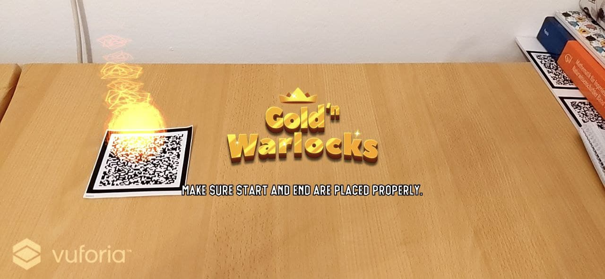
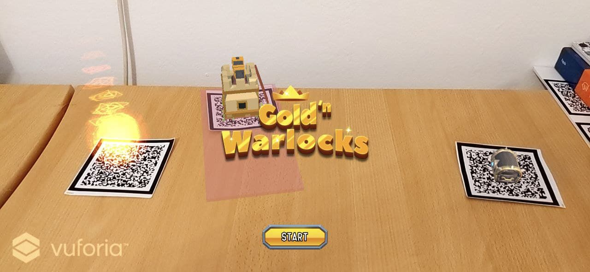
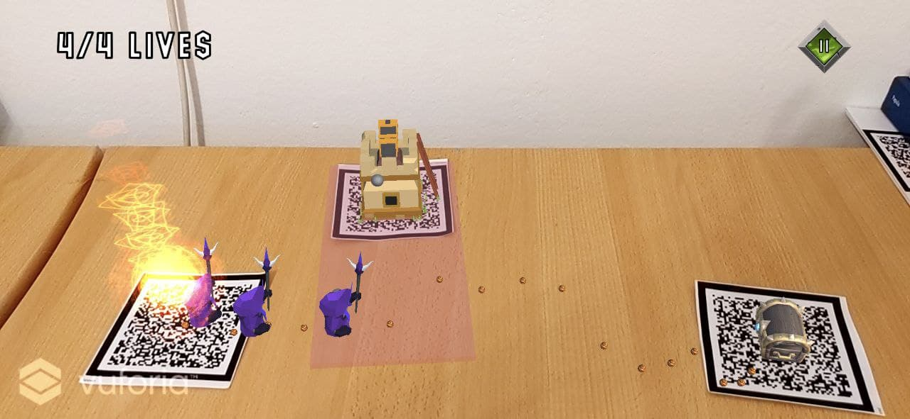
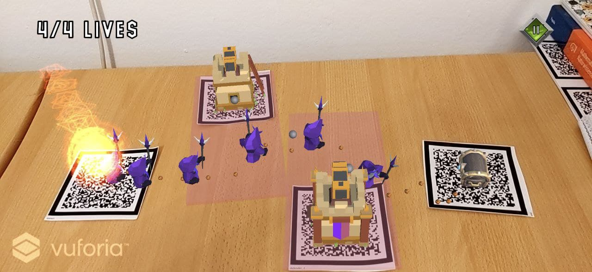
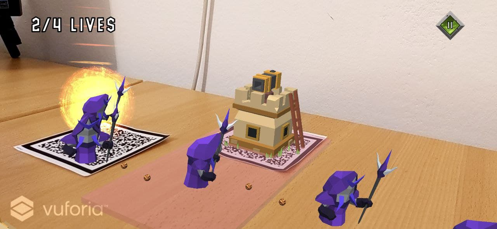
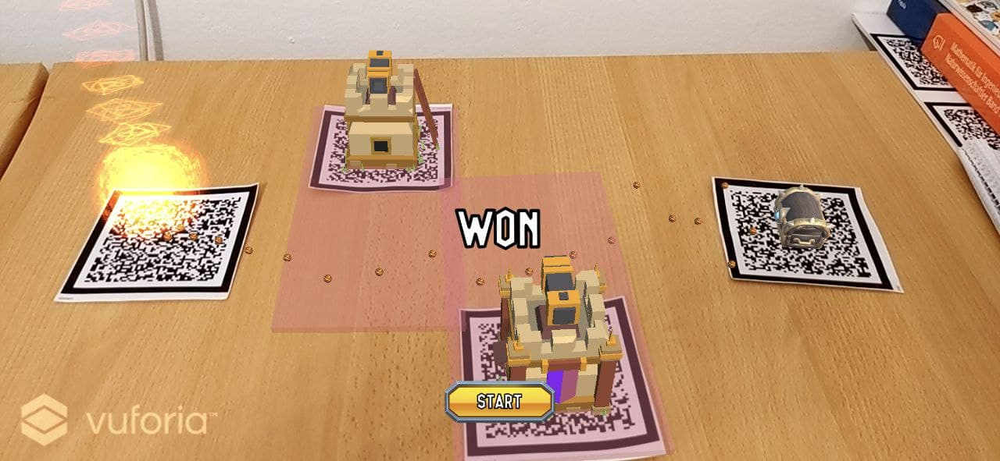
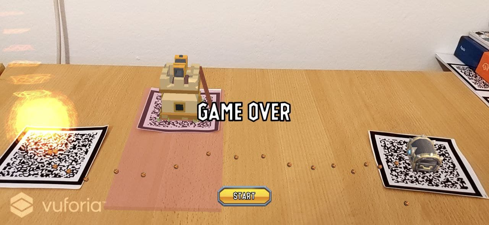

# Tower Defense AR Game
This is a simple tower defense augmented reality game, implemented using only Unity (2019.4.21f1) and Vuforia.

Before the game starts, a random path is generated between the start and end markers. Other markers can be used to place the defender objects 
which will attack an enemy within their reach of action. The game is over when either the player has no more lives left or all enemies have been killed.

## To-Dos
This project is still in development and the following things will be worked on next in version 2:
  - [x] Support of multiple game stages
  - [x] Add more enemy types 
  - [ ] Play sound effects when shooting projectiles
  - [ ] Improve path generation algorithm

These things have already been fixed in version 1.0:
  - [x] Fix weird projectile behaviour
  - [x] UI polishing
  - [x] Replace prototype models with prettier ones
  - [x] Only enable the start button when both start and end markers are being tracked correctly  
  - [x] Optimise the parameters for the enemy spawn time and the gap between projectiles  
  - [x] Include a logo with the game title

## Assets
The following assets are used:
* [Chest](https://assetstore.unity.com/packages/3d/props/stylized-fantasy-chest-pbr-154229)
* [Legion Lich Model](https://assetstore.unity.com/packages/3d/characters/humanoids/fantasy/mini-legion-lich-pbr-hp-polyart-91497)
* [Projectile Metal Texture](https://assetstore.unity.com/packages/2d/textures-materials/metals/metal-06-23812)
* [Spawn Effect Textures](https://assetstore.unity.com/packages/2d/textures-materials/abstract/vibrant-effect-textures-sample-35514)
* [Trollnest UI Buttons & Font](https://assetstore.unity.com/packages/2d/gui/icons/trollnest-free-ui-buttons-140934)
* [Tower](https://assetstore.unity.com/packages/3d/environments/fantasy/meshtint-free-turret-tower-mega-toon-series-155310)
* [Tower 2](https://assetstore.unity.com/packages/3d/environments/fantasy/meshtint-free-turret-tower-02-mega-toon-series-157322)
* [Tower 3](https://assetstore.unity.com/packages/3d/environments/fantasy/meshtint-free-turret-tower-03-mega-toon-series-157654)
* [Lava Texture](https://assetstore.unity.com/packages/2d/textures-materials/nature/stylized-lava-texture-153161)
* [Logo](https://assetstore.unity.com/packages/2d/gui/icons/20-logo-templates-with-customizable-psd-vector-sources-174999)
* [Monster Duo Polyart](https://assetstore.unity.com/packages/3d/characters/creatures/rpg-monster-duo-pbr-polyart-157762)
* [RPG Monster Partners PBR Polyart](https://assetstore.unity.com/packages/3d/characters/creatures/rpg-monster-partners-pbr-polyart-168251)

## Version 1
### Start

### Ingame

### Game Results

